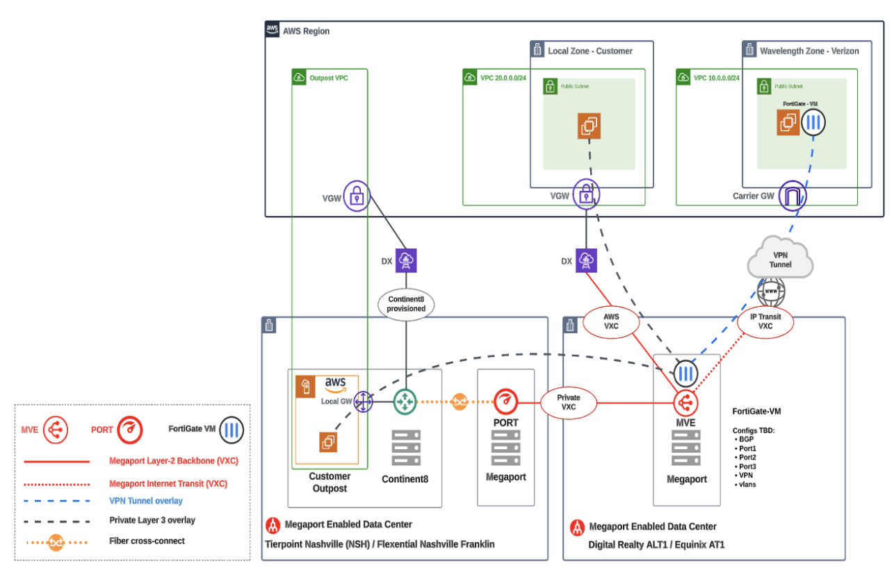
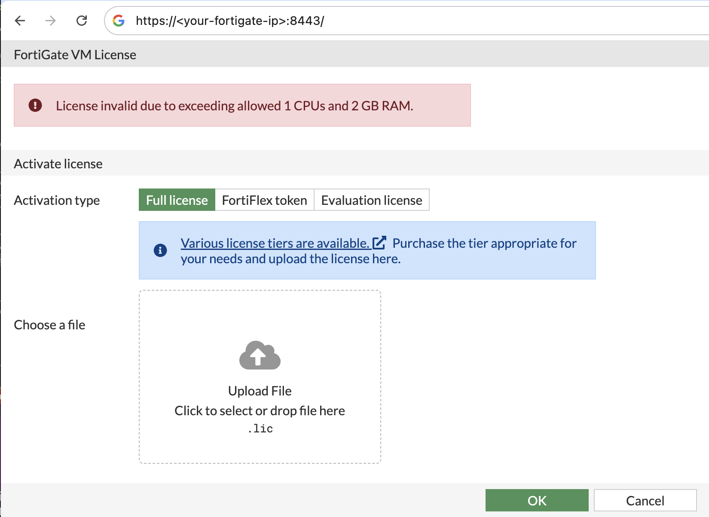

# Resiliency at the Edge with Fortinet, Megaport & AWS Hybrid and Edge Services

In this repository, learn how to automate the deployment of a highly available architecture across AWS Hybrid & Edge Services. To create east-west traffic communication between AWS Wavelength and a secondary location – either an AWS Local or the parent AWS Region – we deploy the following:
- SSL VPN initiated by the Wavelength Zone to create a secure, high-bandwidth east-west traffic flow
- Megaport Virtual Edge (MVE) to support virtual Fortigate to terminate VPN 
- Transit VXC to connect MVE over Megaport backbone to AWS Direct Connect PoP



## Prerequisites
Prior to deployment, you will need to procure a Fortigate license for the Megaport MVE. To get one, reach out to your account representative to get your `license.lic`. You can get an evaluation license from your Fortigate sales representative and register the license to your support account.

Once the Fortigate is deployed by the Terraform module, you can manually upload the license file from the Fortigate UI.




Next, generate new key pair, which will be used by your bastion hosts, client instances and the spoke Fortigate.
```
aws ec2 create-key-pair --key-name megaport-fortinet-demo --output text > megaport-fortinet-demo.pem
```

Be sure to change the `keypair` variable in terraform.tfvars to the `megaport-fortinet-demo`!

## Step 1: Terraform Deployment
To deploy the Terraform modules, run the following commands from this repository's directory:

```
terraform init -upgrade
terraform plan
terraform apply
```

This module consists of the following:
- All required VPC networking for AWS Wavelength Zone and parent AWS Region
- Spoke Fortigate in AWS Wavelength to initiate SSL VPN
- Megaport MVE (Fortigate) to terminate SSL VPN connection
- Megaport Transit VXC to create private, flexible, and on-demand connection between any location on the Megaport network and AWS

**Note:** You might encounter the following error, which requires you to opt-in to the Fortigate AWS Marketplace offering. Follow the instructions below to remediate the error.
```
Error: creating EC2 Instance: OptInRequired: In order to use this AWS Marketplace product you need to accept terms and subscribe. To do so please visit https://aws.amazon.com/marketplace/pp?sku=2wqkpek696qhdeo7lbbjncqli
```

## Step 2: Configure Megaport
Once deployed, be sure to configure the following (as indicated in the Output):

To start, query the Virtual Interface ID of the Meagport VXC
```  
VIF_ID=$(aws directconnect describe-virtual-interfaces --query "virtualInterfaces[?virtualInterfaceName=='AWS-DX'].virtualInterfaceId" --output text)
```
Next, accept the VIF by querying the VGW
```
VGW_ID=$(aws ec2 describe-vpn-gateways --filters "Name=attachment.vpc-id,Values=$(aws ec2 describe-vpcs --filters "Name=tag:Name,Values=fortigate-megaport-aws-edge-hub-vpc" --query "Vpcs[0].VpcId" --output text)" --query "VpnGateways[0].VpnGatewayId" --output text)
aws directconnect confirm-private-virtual-interface --virtual-interface-id $VIF_ID --virtual-gateway-id $VGW_ID
```
Lastly, update the routing of the client private subnet
```
route_table_id=$(aws ec2 describe-route-tables --filters "Name=tag:Name,Values=fortigate-megaport-aws-edge-hub-private-rt" --query "RouteTables[0].RouteTableId" --output text)
aws ec2 delete-route --route-table-id "$route_table_id" --destination-cidr-block 0.0.0.0/0
aws ec2 create-route \
--route-table-id "$route_table_id" \
--destination-cidr-block "0.0.0.0/0" \
--gateway-id "$VGW_ID"
aws ec2 enable-vgw-route-propagation \
--route-table-id "$route_table_id" \
--gateway-id "$VGW_ID"
```
Next, login to the hub Fortigate (MVE)
```
terraform output my-private-key > mve-private-key.pem
chmod 400 mve-private-key.pem
ssh -i mve-private-key.pem admin@$<fortigate-ip>
```

## Step 3: Configure Hub Fortigate (Megaport MVE)
Once SSH'ed into the Fortigate, enable a password and HTTPs access:
```
config system global
set hostname hub-fgt
set admintimeout 15
set admin-sport 8443
end
config system interface
edit port1
append allowaccess https
next
y
end
config system admin
edit admin
set password Megaport
end
```
This will allow HTTPS access and a password to visit the Fortigate UI and prompt the Fortigate to close your SSH session.

Next, visit the Fortigate (`https://<your-ip>:8443`) and upload the license file, prompting the Fortigate to reboot.

Next, be sure to copy the files from `mve_userdata.sh` in the (`modules/megaport/` directory) to the Fortigate, as there is presently no mechanism to automatically load the user data. Note that user data can also be uploaded through the Fortigate UI.

## Step 4: Test SSL VPN Status
To validate the fortigate, first ensure that there are no errors when you copy-paste the `mve_userdata.sh`. 

- To check the connection, `diag vpn ssl list` will show you VPN connection from the client Fortigate. As an example, `from(161.188.0.85)` indicates the Carrier IP of your spoke Fortigate.
```
[2358:root]sconn=0x7f1fa2eae800, from(161.188.0.85) task=tunnel2_loop, fd=31(1:1),34(1:1),-1(0:0),-1(0:0),-1(0:0), pending=0
```

- To view your route table, you can run `get router info routing-table all`. On the hub side, you see `169.254.1.2` corresponding to the Amazon router peer IP.

```
Routing table for VRF=0
S*      0.0.0.0/0 [5/0] via 162.43.143.16, port1, [1/0]
B       10.0.0.0/8 [200/0] is a summary, Null, 00:02:28, [1/0]
B       10.1.0.0/16 [20/0] via 169.254.1.2 (recursive is directly connected, vxc), 00:02:28, [1/0]
C       162.43.143.16/31 is directly connected, port1
C       169.254.1.0/30 is directly connected, vxc
```

- To learn more about the BGP configuration, you can run `get router info bgp summary` to view neighbors, prefixes, and neighbor state:
```
VRF 0 BGP router identifier 169.254.1.1, local AS number 64512
BGP table version is 1
2 BGP AS-PATH entries
0 BGP community entries

Neighbor    V         AS MsgRcvd MsgSent   TblVer  InQ OutQ Up/Down  State/PfxRcd
169.254.1.2 4      64513      14      15        1    0    0 00:04:54        1

Total number of neighbors 1
```

- To drill into a neighbor, run `get router info bgp neighbor [neighbor-ip] [action]`. Replace `[neighbor-ip]` with an 169.254.1.2 (Amazon peer IP) and recommended actions include: `routes` or `advertised-routes`. 
```
get router info bgp neighbor 169.254.1.2 
received-prefix-filter    show received prefix-list filter from bgp neighbor
routes                    show neighbor routes
advertised-routes         show neighbor advertised-routes
received-routes           show neighbor received routes
```

- Login to the spoke Fortigate via SSH (or web GUI) and run the command: `get router info routing-table all` to validate routes received from the Hub Fortigate (running in Megaport). You should see 3 routes for RFC1918 addresses. 

## Step 5: Test Connectivity
To test connectivity from the hub to spoke, visit the `test_instructions_hub` and `test_instructions_spoke` output values (just run `terraform output`).

**Test Ping from Hub (Region) to Spoke (Wavelength Zone)**: Follow the instructions in the `test_instructions_hub` output value.

**Test Ping from Spoke (Wavelength Zone) to Hub (Region)**: Follow the instructions in the `test_instructions_spoke` output value.

## Terminate Resources
To terminate the resources for this environment, we need to delete the VGW and destroy the  resources specified by the Terraform state file:
```
VGW_ID=$(aws ec2 describe-vpn-gateways --filters "Name=attachment.vpc-id,Values=$(aws ec2 describe-vpcs --filters "Name=tag:Name,Values=fortigate-megaport-aws-edge-hub-vpc" --query "Vpcs[0].VpcId" --output text)" --query "VpnGateways[0].VpnGatewayId" --output text)
aws ec2 delete-vpn-gateway --vpn-gateway-id $VGW_ID
terraform destroy -auto-approve
```

